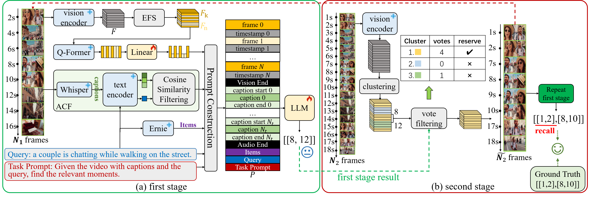

# From Coarse to Fine: Caption Assisted Multimodal Large Language Model for Video Moment Retrieval

* Authors: [Peiyu Xie](https://tjhd1475.github.io/)

[//]: # (* Paper: [arxiv]&#40;http://arxiv.org/abs/2406.18113&#41;)

Multimodal Large Language Models (MLLMs) have demonstrated significant potential across various multimodal tasks, including retrieval, summarization, and reasoning. However, it remains a substantial challenge for MLLMs to understand and precisely retrieval specific moments from a video, which requires fine-grained spatial and temporal understanding of a video. To tackle the issue, we propose the Caption Assisted MLLMs from Coarse to finE (CALCE). By selecting key frames from video events and converting audio into captions, CALCE achieves fine-gained segmentation of video events, providing a robust foundation for precise moment retrieval. Moreover, we explore a comprehensive multi-stage training framework, further allowing our proposed method to progressively retrieval video moments from rough to precise.

<p align="center">
  
</p>

[//]: # (<p align="center">)

[//]: # (  )

[//]: # (</p>)


# Setup

## Install Dependencies
Creating conda environment

```bash
conda create -n CALCE python=3.8
conda activate CALCE
pip install -r requirements.txt
```

## Download Datasets and Preprocess
We train CALCE on QVHighlights and Charades-STA.

| Dataset      | Original                                        | Preprocessed | Captions |
|--------------|-------------------------------------------------|--------------|--------- | 
| QVHighlights | [Download](https://github.com/jiyanggao/TALL)   | [Download](https://drive.google.com/drive/folders/1ih6C2onYEMNZa2x8DbpmkmBriGkO-vRi?usp=sharing)| [Download](https://drive.google.com/file/d/1PibKAkATuZmtR8kl3bRsp7Fy2TuS6MY0/view?usp=sharing)
| Charades-STA | [Download](https://github.com/jayleicn/moment_detr) | [Download](https://drive.google.com/drive/folders/1O0Wo-aXzw0yT-Gjsou0J9O96iw-OyuJ8?usp=sharing)| - |

Please download original data and preprocess them via our [scripts](process_data/data_preprocess.ipynb) (Path needs to be customized).

Or download the preprocessed data we provide, and put them under [annotaion path](lavis/datasets/annotations)

Then, Download the QVHighlights caption files (or extract it by [Whispher](https://github.com/openai/whisper)), and put them under the same folder of the video folder. 

Path/To/QVHighlights \
   ├── videos \
  │       ├── xxxxxx1.mp4 \
  │       └── xxxxxx2.mp4 \
  │            ...... \
   └── srts \
          ├── xxxxxx1.srt \
          └── xxxxxx2.srt \
                  ...... 
## Download Checkpoints
The checkpoints of the two stages training ara provided below.

| Dataset      | Stage 1    | Stage 2                                                                                       |
|--------------|------------|-----------------------------------------------------------------------------------------------|
| QVHighlights |[Download](https://drive.google.com/file/d/1HDNOF2ea_saqWvsB0mAPR4okThiR63Z0/view?usp=sharing)|[Download](https://drive.google.com/file/d/1yDxOy1XpV3XpS86sP4awE7zhuvwFVSYB/view?usp=sharing) |
| Charades-STA |[Download](https://drive.google.com/file/d/1q5QzKQfFyYEa33P1sRNWLCRyxj5YP8bj/view?usp=sharing)|[Download](https://drive.google.com/file/d/1J3J3qCZ0bKdYjQIQZ61k-xnYsCA2JuI_/view?usp=sharing)|

Please download the checkpoints and put them under [checkpoint path](lavis/results).

## Project Structure

CALCE \
└── lavis \
         ├── datasets \
         │       └──annotations \
         │                  ├── charades \
         │                 │        ├── train.json \
         │                 │        └── test.json \
         │                  └── qvh \
         │                           ├── train.json \
         │                           ├── val.json \
         │                           └── test_dummy.json \
         └── results \
                     ├── charades \
                    │        ├── CALCE_Charades_60_stage1-1 \
                    │       │          └── checkpoint.best \
                    │        └── CALCE_Charades_120_stage2-1 \
                    │                   └── checkpoint.best \
                     └── qvh \
                             ├── CALCE_QVH_75_stage1-1 \
                            │          └── checkpoint.best \
                             └── CALCE_QVH_75_stage1-1 \
                                        └── checkpoint.best 


# Training and Inference

We provide CALCE training and inference script examples as follows.

And please refer to [dataset page](lavis/configs/datasets/) to customize your data path.

You might want to update the [config files](lavis/projects/CALCE/train/) for the respective runs to fit on your machine. They are currently set to run on 4 A100-80GB GPUs.

## Evaluation
### Stage 1
```bash
sh run_scripts/CALCE/eval/qvh_stage1.sh
sh run_scripts/CALCE/eval/charades_stage1.sh
```
## Merge Stage 1 Result
```bash
python process_data/merge_stage1_result.py --eval
```
### Stage 2
```bash
sh run_scripts/CALCE/eval/qvh_stage2.sh
sh run_scripts/CALCE/eval/charades_stage2.sh
```

Should return (on val split):

| QVH     | R1@0.5 | R1@0.7 | mIoU   | mAP@0.5 | mAP@0.75 |
|---------|--------|--------|--------|---------|----------|
| Stage 1 | 78.00  | 64.84  | 72.89  | 70.81   | 57.73    |
| Stage 2 | 78.13  | 65.42  | 72.95  | 71.02   | 58.11    |

| Charades-STA | R1@0.5 | R1@0.7  | mIoU |
|--------------|--------|---------|------|
| Stage 1      | 68.87  | 49.87   | 59.13|
| Stage 2      | 70.35  | 50.59   | 60.06| 

## Training

### Stage 1
```bash
sh run_scripts/CALCE/train/qvh_stage1.sh
sh run_scripts/CALCE/train/charades_stage1.sh
```
### Stage 1 Infer
get the stage 1 result on the training split.
```bash
sh run_scripts/CALCE/infer/qvh.sh
sh run_scripts/CALCE/infer/charades.sh
```
### Merge Stage 1 Result
```bash
python process_data/merge_stage1_result.py
```
### Stage 2
```bash
sh run_scripts/CALCE/train/qvh_stage2.sh
sh run_scripts/CALCE/train/charades_stage2.sh
```


# Acknowledgments

We thank the developers of [MR.Blip](https://github.com/sudo-Boris/mr-Blip)  for their public code release.

[//]: # (# Reference)

[//]: # ()
[//]: # (Please cite our paper if you use our models in your works:)

[//]: # ()
[//]: # (```bibtex)

[//]: # (@article{boris2024surprisingeffectivenessmultimodallarge,)

[//]: # (      title={The Surprising Effectiveness of Multimodal Large Language Models for Video Moment Retrieval}, )

[//]: # (      author={Meinardus Boris and Batra Anil and Rohrbach Anna and Rohrbach Marcus},)

[//]: # (      year={2024},)

[//]: # (      eprint={2406.18113},)

[//]: # (      archivePrefix={arXiv},)

[//]: # (      primaryClass={cs.CV},)

[//]: # (      url={https://arxiv.org/abs/2406.18113}, )

[//]: # (})

[//]: # (```)
